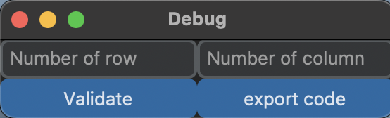
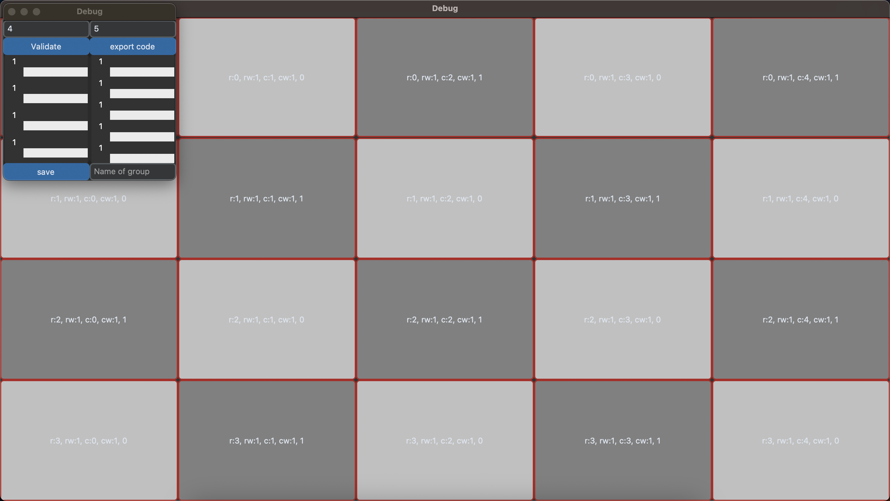
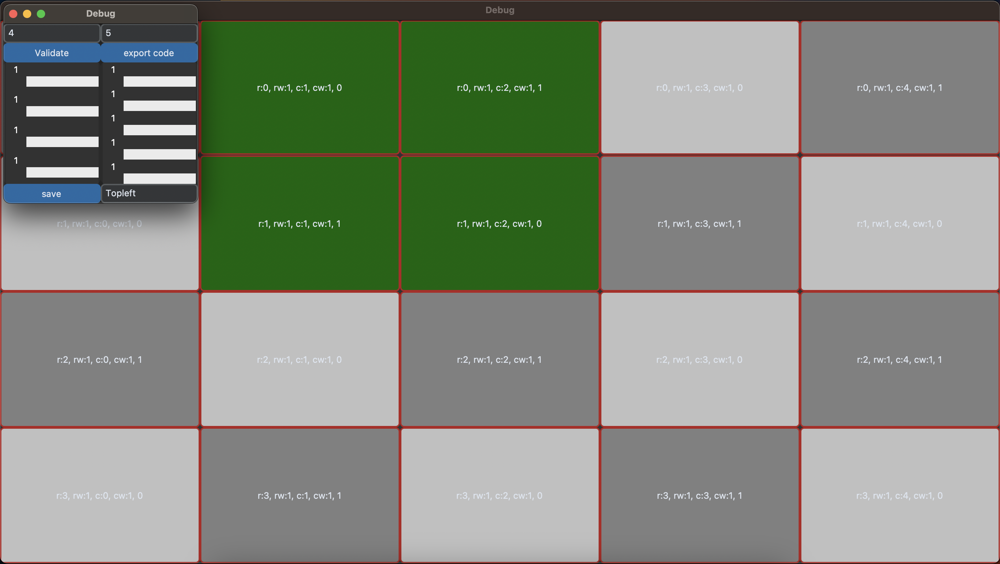
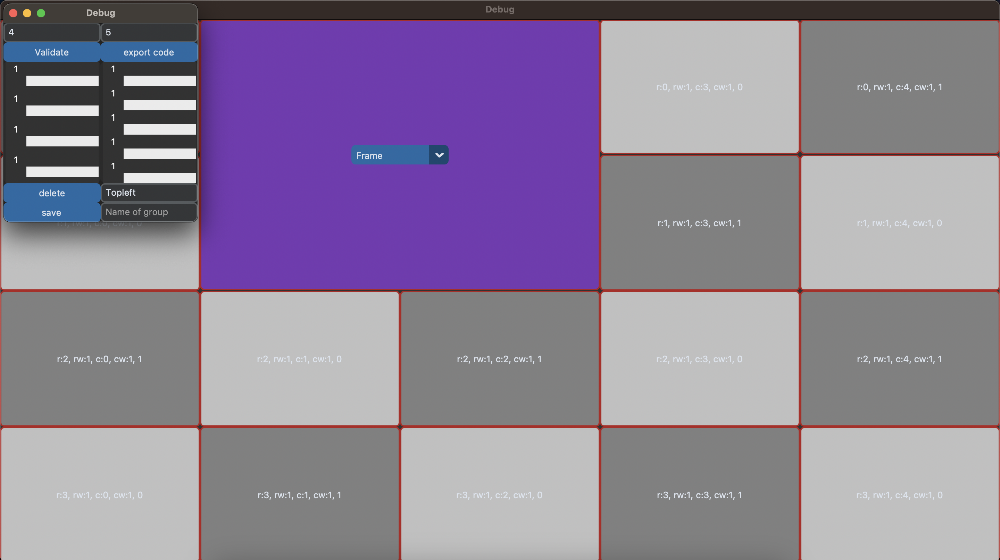
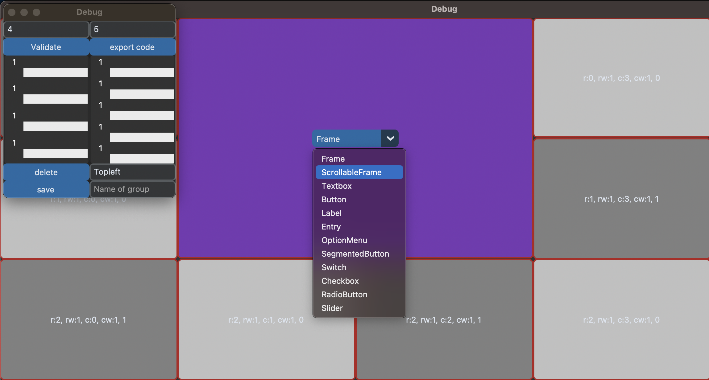
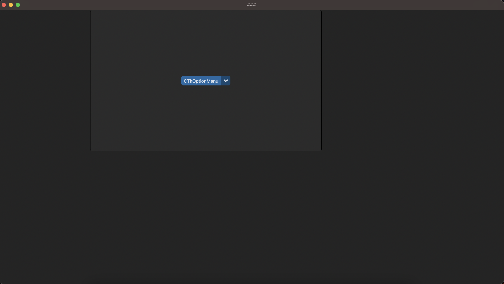

## tkinter_grid_helper

Aide pour faire un layout customtkinter avec une grille 
avec export d'un template de code python avec les frame que vous avez créé de manière interactive 

Alpha avec bug 
Faire des issues GitHub pour toute demande de features

Tuto 
Lancer debug_tkinter.py  
  
Choix du nombre de lignes et de colonnes

Cliquez sur Validate 
Une grille s'affiche, vous pouvez modifier la taille de chaque ligne ou colonne grace au sliders.

Cliquez sur les cases que vous voulez regrouper elles deviennent vertes

Entrez un nom pour ce groupement puis cliquer sur save 

Voilà votre futur groupement maintenant choisissez le type de widget qui sera placé à l'intérieur

Cliquez sur exporter quand vous avez placé tous les groupes (recommendation : un groupe = un widget) dont vous aurez besoin 
Un fichier my_template.py a été créer excécuté/modifier le a votre guise mais la base est deja là.

Contact : theo.mathieu@insa-lyon.fr

TODO :
- Scrollableframe sur slider 
- commentaire sur le export 
- message erreurs 